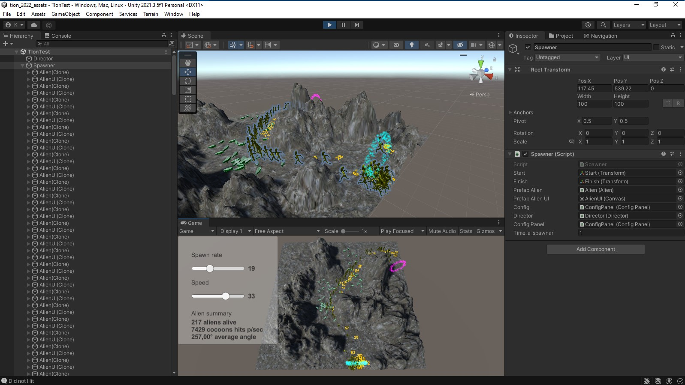

# Test Prueba Unity tion industries

## algunas cosas creadas detalle documentación simple.

Nueva Clase destroy para el gameobject posicion final.

En Clase director....verificar_cada_un_segundo...promedio_angulo_de_todos_los_aliens

En Clase Aliens.... move_ariel_AI....fixear_navmesh_init... fixed update con raycast

En Clase ConfigPanel.... Event on_change_sliderSpeed....Event on_change_sliderRate

En Clase Spawner.... spawn_rate_aliens....spawnear_cada_cierto_tiempo